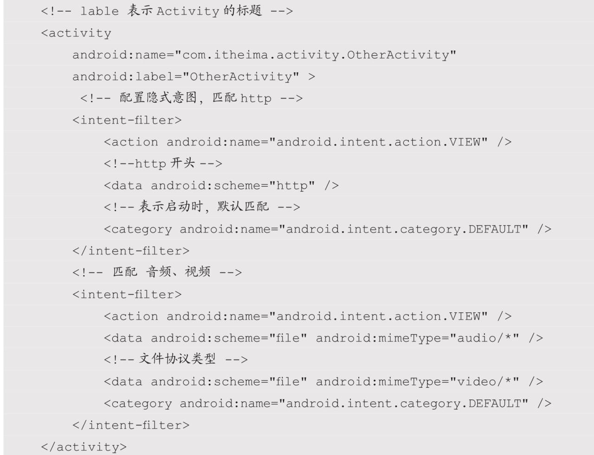

- 消息的接收避免用客户端轮循的方式。可以利用服务端推送。如果非要轮循，合理的设置频率。
-	应用处于后台时，避免某些数据的传输，比如感应器，定位，视频缓存。
-	页面销毁时，取消掉网络请求。
-	限制访问频率，失败后不要无限的重连。
-	合理的选择定位精度和频率。
-	使用缓存。如果数据变化周期比较长，可以出一个配置接口，用于记录那些接口有变化。没变化的直接用缓存。
-	减少广播的使用频率。可以用观察者，startActivityForResult等代替。
- 图片

